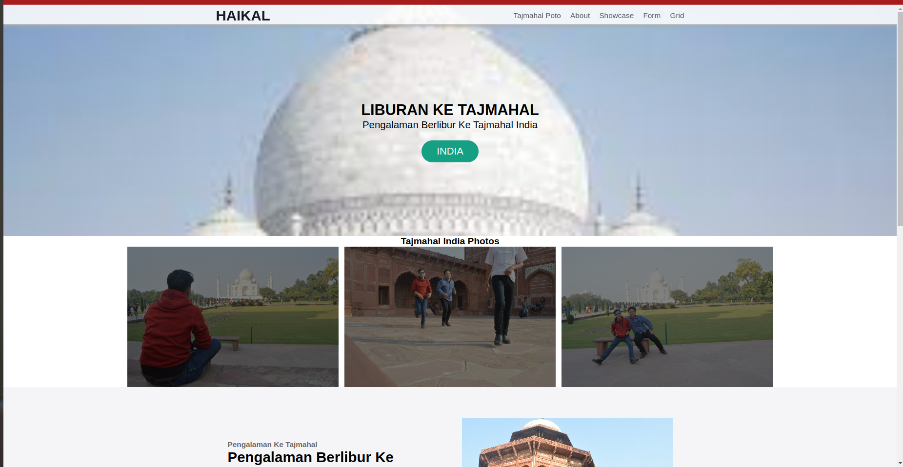

# Muhammad-Haikal-Shahab_Weekly_W2

# Description :
ini adalah tugas kedua responsive menggunakan html css dan js [Muhammad Haikal Shahab](https://haikalshahab2.netlify.app), membuat halaman responsive menggunakan html,css dan javascript di Revou.

- applying custom font using @font face (ok)
- applying text shadow to text (ok)
- applying 1 responsif background image (using contain cover or suit cover)  (ok
- applying 1 responsif image with picture + source + srcset (ok)
- applying form element ( date,color,localdate,range ) (oK) 

## Advance
- Accessibility and Seo >=90 (Ok)
- Create Day Mode , Night Mode or using  webstorage (Ok)
- Create image Corousel without using Js (ok)

 

hi, i'm [Muhammad Haikal Shahab](https://haikalshahab2.netlify.app), a passionate self-taught full stack web developer and a freelance software engineer from indonesia. my passion for software lies with dreaming up ideas and making them come true with elegant interfaces. i take great care in the experience, architecture, and code quality of the things I build.

  
  
- 💼 i'm work in PT PUSRI Palembang, [email](mailto:haikal.pusri@gmail.com) :)
- 💬 ask me about anything, i am happy to help;

**languages and tools:**  

<code></code>
<code></code>
<code></code>
<code></code>

 
 
 

